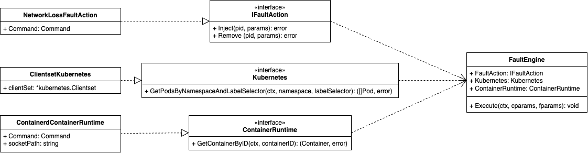

# sinth-chaos-poc

## What is?

The Synth Chaos POC is a Proof of Concept of an application that injects/removes faults in a set of pods in Kubernetes. This set of pods is specified by a namespace and a label, in whith Synth Chaos will search in Kubernetes by mathced pods. The faults can be any action that causes an unu behavior in the system. In this POC, only one fault was implemented - Network Loss fault. This application works on top of `litmuschaos/experiment-alpine` docker image.

## Architecture

This application was desigend to be agnostic to any implementation of third parties (container runtime, kubernetes client and linux command executor). The core of application - the FaultEngine struct - only depends of interfaces, that are implementations by default provided with this POC.

The Fault Engine was designed to works with any fault that implements the interface IFaultAction. In this POC, is provided only one FaultAction, the NetworkLossFaultAction. New faults can be writeen without affect existing code, making it easily extensible.

Bellow you can see a UML representation of the solution: 



## Build a docker image

To build a docker image of Synth Chaos, you can run the commands bellow:

```bash
make docker
```

## How it works?

Once the Synth Chaos is launch as a pod in a Kubernetes environment, executing the `/sinth/sinth`command, it will instantiate a new FaultEngine with a Network Loss action. All params (comoon ans fault params) must be specified as env vars, as described bellow:

* NAMESPACE: the namespace where Sinth will search for pods
* LABEL_SELECTOR: the label selector to be applied when Sinth search for pods
* NETWORK_INTERFACE: the network interface in which Network Loss fault will be injected
* NETEM_COMMANDS: commands netem to be used in Network Loss fault injection
* SOCKET_PATH: container runtime socket path
* DESTINATION_IPS: ips in which Network Loss fault will affect

The pod that runs Synth must be privileged access, access to host PIDs and run with the `NET_ADMIN`, `SYS_ADMIN` and `SYS_PTRACE` security context capabilities. This pod depends of a RBAC service account wiht privilegies to search pods in the Kubernetes environemnt.

You can find an exemple of how to run Synth as a pod in `./k8s/pod.yaml`. In this example is been used the `litmus-admin` service account, that is installed with the Litmus Chaos Helm Chart.

## Run complete example

To build a docker image and run the example `./k8s/pod.yaml`, you can run the following command:

```bash
make all
```
